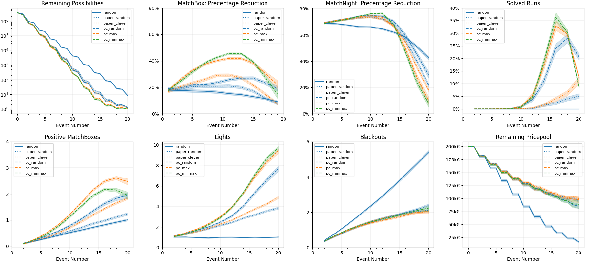

# 🎯 AYTO-Strategies

This repository is dedicated to comparing different strategies for the RTL+ show **"Are You The One?"**. The goal is to evaluate various solvers that attempt to find the correct matches using different approaches. The repository includes implementations of several solvers, each with its own strategy for making decisions based on the information available from the game events.


## 📱 Follow @AYTOrakel on Instagram
This is a side project from AYTOrakel.
[Follow AYTOrakel on Instagram](https://www.instagram.com/AYTOrakel) to stay up to date and join the discussions. 
[Check out the AYTOrakel GitHub](https://github.com/jjccmm/AYTOrakel) to make your own predictions. 


## 🎮 AYTO Game

The `AYTOGame` class in `ayto_game.py` simulates the game environment for **"Are You The One?"**. It initializes the game with 10 players and generates all permutations of the numbers 1 to 10, selecting a random permutation as the correct matching solution. The class keeps track of the prize pool, played rounds, solved matches, blackouts, and other game states.

### 🛠️ Methods:
- `match_box(index, number)`: Takes a number and an index as input and reveals if this fits the matching solution.
- `match_night(seating)`: Takes a vector as input and returns the number of elements that match the solution (number of lights).
- `game_state()`: Returns the current state of the game (`running`, `solved`, `game_over`) and the game log.


## 🧠 Solvers
A solver is able to generate an input for the match box and the matching night and can process the results of both events. There are different `solver` classes in `ayto_solver.py`.

### 🛠️ Methods:
- `generate_matchbox_input()`: Generates and returns a pair for the match box.
- `process_matchbox_output(input, result)`: Processes the result of the match box.  
- `generate_matchnight_input()`: Generates a seating vector for the next matching night.
- `process_matchnight_output(input, result)`: Processes the result of the matching night.  

### 🎲 Random Solver
The **Random Solver** does not use any information from the game events and blindly guesses the matches. It does not keep track of any constraints, previous results, or previous decisions made.

### 📜 Paper Solver
The **Paper Solver** uses a strategy that involves making a table of the information from the matching night and a grid that states for each pair if they can be a match or not. This is a strategy that someone could do on paper, but there will be situations where choices for the game events do not fulfill all known constraints.

- **Random Paper Solver:** For the unknown pairs, this solver tries to select random options that still seem valid based on the given constraints.
- **Clever Paper Solver:** Similar to the Random Paper Solver, but instead of selecting random valid pairs, it prioritizes pairs with the least amount of options left, increasing matching probabilities.

### 💻 PC Solver
The **PC Solver** maintains a complete list of all remaining options that fulfill the given constraints from all previous events. As this list is quite long (10!), this is not feasible to do manually and requires computation.

- **PC Random Solver:** Always selects random options from the remaining valid choices while ensuring constraints are met.
- **PC Max Probability Solver:** Chooses the pair with the highest probability of being a match.
- **PC Min-Max Probability Solver:** Selects pairs that minimize the worst-case scenario by optimizing the number of possible solutions left after each event.


## 🚀 Runner Script
The `ayto_runner.py` script runs simulations of the game using different solvers and compares their performance. It uses multiprocessing to run multiple simulations in parallel and generates plots to visualize the results.

### 🛠️ Functions:
- `play_ayto(run, ayto_solver)`: Simulates a single run of the game using the specified solver.
- `create_plots(df)`: Generates performance plots, including metrics like remaining possibilities, percentage reduction, solved runs, positive match boxes, lights, blackouts, and prize pool earnings.


## 📊 Evaluation
Each solver played **2,000 runs** of the AYTO Game. The **Random Solver** failed to solve any runs. The **Paper-based solvers** had a success rate between **13-23%**, as manually considering all constraints is difficult. The **PC-based solvers** performed significantly better as they fully utilized all constraints.

| Solver       | Solved Runs  | Mean Events to Solve | Mean Earned Prize Pool |
|-------------|--------------|----------------------|------------------------|
| random       | 0.00%        | N/A                  | N/A                    |
| paper_random | 13.15%       | 17.76                | 84,790 €               |
| paper_clever | 23.65%       | 18.23                | 76,215 €               |
| pc_random    | 88.45%       | 17.07                | 110,231 €              |
| pc_max       | 98.50%       | 16.47                | 117,081 €              |
| pc_minmax    | 99.45%       | 16.35                | 111,764 €              |



The detailed evaluation shows that **Matching Nights** provide higher theoretical information gain than Match Boxes. However, only the **PC-based solvers** can fully utilize constraints to maximize information gain.

### 📺 Comparison to Performance in the Show
Participants in the show have limited ways to track decisions and derive strategies. Match Boxes provide clearer information, while Matching Nights require complex reasoning. Additionally, participants don’t always get to choose who goes into the Match Box.

Despite these challenges, **7 out of 9 (78%) AYTO Germany seasons** were successfully solved, suggesting that intuition plays a crucial role. This is evident from the number of lights in the first three **Matching Nights**, where participants consistently outperform even the best solvers:

| Matching Night | Average Lights (Best Solver) | Average Lights (Show) |
|---------------|-----------------------------|----------------------|
| 1             | 1.1                         | 2.4                  |
| 2             | 1.4                         | 2.44                 |
| 3             | 1.75                        | 2.9                  |

🔍 **Conclusion:** Intuition matters! Love, or at least a strong gut feeling, seems to help contestants make better pairing decisions than pure mathematical calculations. Without this human factor, even advanced solvers struggle to win consistently.


## ⚙️ Usage

1️⃣ Install requirements:
```bash
pip install -r requirements.txt
```

2️⃣ (Optional) Implement your own solver classes in `ayto_solver.py` and add them to `ayto_runner.py`.

3️⃣ Set the desired number of runs in `ayto_runner.py` and run the script:
```bash
python ayto_runner.py
```
